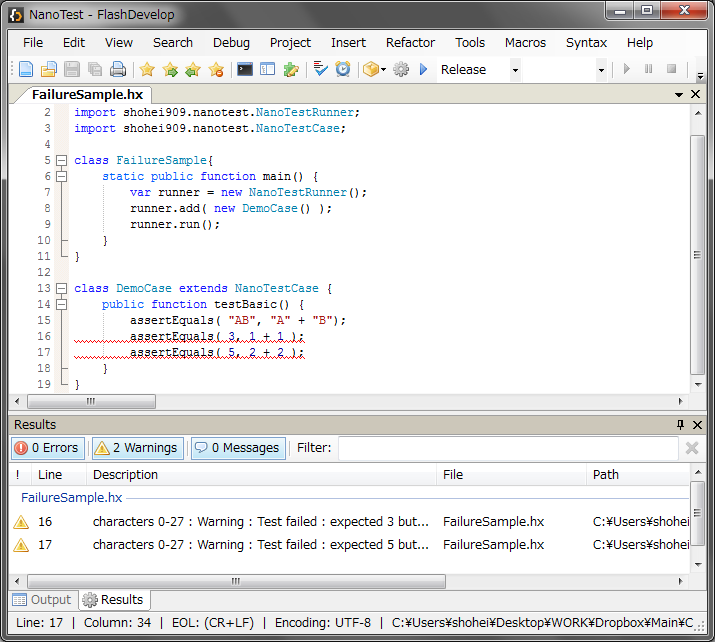

NanoTest is a light weight test library. Its interface is similar to the [haxe.unit](http://haxe.org/doc/cross/unit) testing framework, but it can run as pre-compilation macro and can output test failures as compiler warnings or errors.

#NanoTest with FlashDevelop



NanoTest can display test failures as compiler warnings on the Result Panel of [FlashDevelop](http://www.flashdevelop.org/) and other IDEs.

#Installing NanoTest

You can install NanoTest from haxelib.  
```
haxelib install nanotest
```

#Running test as macro

Create test classes and save them as sample/TestSample.hx.
```hx
package sample;
import shohei909.nanotest.NanoTestRunner;
import shohei909.nanotest.NanoTestCase;
 
class TestSample {   
    static function main(){
        var r = new NanoTestRunner();
        r.add(new SampleCase());
        r.run();
    }
}
 
class SampleCase extends NanoTestCase {
    public function testBasic(){
        assertEquals( "A", "A" );
    }   
}
```

Create compile.hxml with the content:

```
--no-output
--macro sample.TestSample.main()
-lib nanotest
```

Compile it on commandline

```
haxe compile.hxml
```

The test function run as macro, and the result will be success.

#Output test failures as compilation errors

Use NanoTestRunner.error as failure output function.
```hx
var r = new NanoTestRunner(NanoTestRunner.error);
```

#Improvements from haxe.unit

NanoTestCase has some addtional functions,

<dl>
<dt>assertThrows(func:Void->Void, ?isSuccess:Dynamic->Bool, ?p:PosInfos)</dt>
<dd>assert a test exepect func to throw exception. If isSuccess function is set, the thrown exception is tested by the isSuccess function.</dd>
<dt>globalSetup()</dt>
<dd>setup which is run once per class of tests</dd>
<dt>globalTearDown()</dt>
<dd>tearDown which is run once per class of tests</dd>
<dt>success(?posInfos:PosInfos)</dt>
<dd>output a success</dd>
<dt>fail(message:String, ?posInfos:PosInfos)</dt>
<dd>output a failure</dd>
<dt>error(e:Dynamic)</dt>
<dd>output the current exception</dd>
<dl>

and the **assertEquals** function supports EnumValue.

#License

The MIT License
